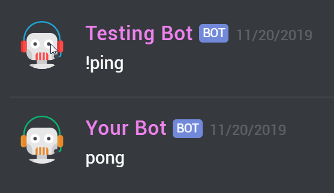

# Discord Response Mock

> Making the behavior of your discord bot testable

<br/>
<p>
<!--Build-->
<a href="https://github.com/KaindlJulian/discord-response-mock/actions?query=workflow%3Abuild"></a>
<!--npm ver-->
<a href="https://www.npmjs.com/package/discord-response-mock"></a>
<br/><br/>
<!--npm banner-->
<a href="https://www.npmjs.com/package/discord-response-mock"></a>
</p>
<br/>

## Prerequisites

- ID of a discord guild to test in
- The token of a bot application with admin rights on this guild
- If you want to test a bot it should be running in a seperate process

For more information take a look at the [setup FAQ](guild_bot_setup.md).

## Getting started

#### Install

:exclamation: This package relies on a connection to the given discord guild.

```
npm install --save-dev discord-response-mock
```

## Examples

### Responses

#### Basic

```js
import { ResponseClient } from 'discord-response-mock';

const client = await new ResponseClient().setup(
  '[TEST_GUILD_ID]',
  '[TEST_BOT_TOKEN]',
);

client.write('!ping').then(response => {
  console.log(response.content); // pong
});
```

In the discord client this will look like:

<a float="right" href="https://support.discordapp.com/hc/en-us/articles/204849977-How-do-I-create-a-server"></a>

#### Mocha command test

A mocha test for a command of your discord bot could look like this.

```js
import assert from 'assert';
import { ResponseClient } from 'discord-response-mock';

const options = {
    messagePrefix: '!',
    specificUserId: '[YOUR_BOT_ID]',
    responseTimeout: 3000
};

let client;

before(async () => {
    client = await new ResponseClient(options).setup('[TEST_GUILD_ID]', '[TEST_BOT_TOKEN]');
});

describe('ping', function () => {
    this.timeout(options.responseTimeout);    // mochas default timeout is 2s

    it('should respond with correct message', done => {
        client.write('ping').then(response => {
            assert.equal(response.content, 'pong');
            done();
        });
    });
});

after(async () => {
    await client.cleanup();
});
```

### Mocking

#### Message Object

```js
import { MockClient } from 'discord-response-mock';

const mock = await new MockClient().setup(
  '[YOUR_GUILD_ID]',
  '[YOUR_BOT_TOKEN]',
);

const message = await mock.message('message content');
```

## Options

```js
const opts = {
    /**
     * If set and a valid discord text channelId, the tests will be performed on
     * this channel. Otherwise a tempory channel will be created.
     *
     * @type {string}
     * @memberof ClientOptions
     */
    channelId?: string;

    /**
     * If set and a valid discord voice channelId, the bot will automatically
     * connect to this channel.
     *
     * @type {string}
     * @memberof ClientOptions
     */
    voiceChannelId?: string;

    /**
     * Changes the name of the temporary testing channels. voice and text.
     *
     * @type {string}
     * @memberof ClientOptions
     * @default 'Running tests | created: Mon, 01 Jan 2019 00:00:00 GMT'
     */
    tempChannelName?: string;

    /**
     * Sets a string that will be prefixed to each message
     *
     * @type {string}
     * @memberof ClientOptions
     */
    messagePrefix?: string;

    /**
     * Sets a timeout on how long to wait for responses. Can only be between 100 and 10000 __milliseconds__.
     *
     * `100 <= timeout <= 10000`
     *
     * @type {number}
     * @memberof ResponseClientOptions
     * @default 5000
     */
    responseTimeout?: number;

    /**
     * If set, only use the responses from this userId. Others are filtered out.
     * If this field is not set, the first response will be returned.
     *
     * @type {string}
     * @memberof ResponseClientOptions
     */
    specificUserId?: string;
};
```
