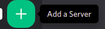

# Setup FAQ

## Discord guild

### Why do I need a discord guild ?

The discord.js library is not mockable without the existance of a real discord guild. So this package assumes you have created a Guild where the tests will be run and know its ID.

### How do I create a discord guild ?

### How to get the ID of my discord guild ?

-   Enable developer mode in your discord client
-   Right click the guild icon
-   Select "Copy ID"

More detailed guide: https://support.discordapp.com/hc/en-us/articles/206346498-Where-can-I-find-my-User-Server-Message-ID-

## Test bot

This is **not** the bot you want to test. This bot will be used internally to send the messages and await for a response. This package assumes you have created a discord bot application and know its token.

### How do I create a discord bot ?

-   Go to https://discordapp.com/developers/applications/
-   Select "New Application"
-   Enter a name for the application
-   Navigate to the bot dashboard (sidebar)
-   Select "Add Bot"
    -   You need to rename your application if there is an error like: "Too many users have this username"

### How do i get the token of my test bot?

Assuming you have created a discord application and bot user.

-   Go to https://discordapp.com/developers/applications/[your-app-id]/bots
-   Click "Copy" at the **Token** section

## Connecting the bot to the guild

The test bot must have admin permissions on the guild you want to run tests in.

### How to add the test bot to my guild with admin permissions ?

Assuming you have a guild to test in and you created a discord application with a bot user.

 

-   Go to https://discordapp.com/developers/applications/[your-app-id]/oauth
-   At the **OAuth2 URL Generator**
-   Select the `bot` scope
-   Select the `Administrator` bot permission
-   Copy the generated url and open it with your browser
